The Ticket to H-1B Visa Lottery: An Analysis on LCA Disclosure Data
========================================================
author: Rosey Cao
date: Dec 2nd 2020
autosize: true

Problem Statement and Background
========================================================

**What is H-1B visa?**

- Non-immigrant temporary work visa
- International students
- US companies' requests for external labour

**Why talk about H-1B now?**
- Fluctuating policies
- Working opportunities after graduation

Problem Statement and Background (continued)
========================================================

**How to explore the question H-1B visa certification?**
- Four basic requirements: **specialty occupation**, **prevailing wage**, employee qualification, H-1B quota
- Labor Condition Application(LCA) submitted to Department of Labor

Methods explored
========================================================

**Data Collection**
- Sources of LCA data

  - *H-1B salary database*
  - Foreign Labor Certification Data Center
  - Office of Foreign Labor Certification, etc.

- Webscraping

Methods explored(continued)
========================================================

**Data Wrangling**
- Explorary data analysis
- Visualization
- *pandas & numpy packages*

Methods explored(continued)
========================================================

**Machine learning**
- Predict LCA certification
- Interpretable
- *scikit & pdpbox packages*

Methods Used & Result(1)
========================================================
**Data Collection**
- Webscraping
  - Main page: extract relavant tags
  - Build URLs and scrape
  - *Problem: Data not available for year 2020/2019*
  - *Solution: year 2018*

Methods Used & Result(2)
========================================================
**Data Collection(continued)**
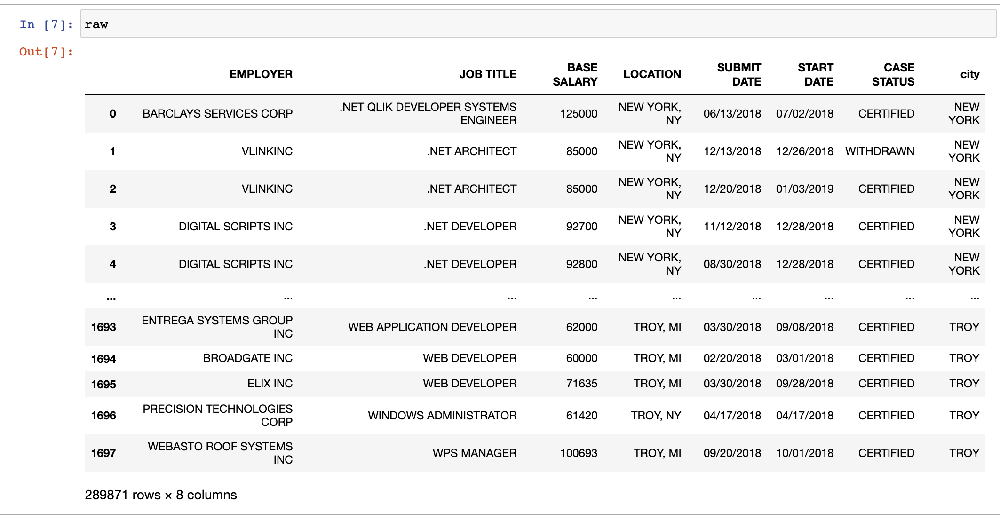
  - *Problem: Job_title column has messy codes*
  - *Solution: clean by matching values in a whitelist*

Methods Used & Result(3)
========================================================
**Question 1: Which companies have the highest number of H1B filings in 2018? What about grouping by cities? What are the most popular job titles?**
- Method chain: groupby, sortvalues

Methods Used & Result(4)
========================================================

Methods Used & Result(5)
========================================================
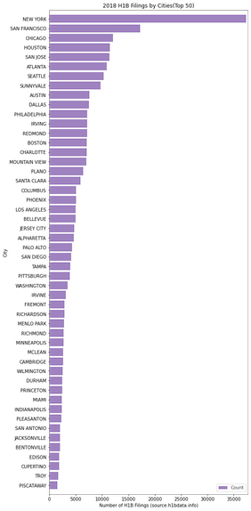

Methods Used & Result(6)
========================================================

Methods Used & Result(7)
========================================================
**Question 2: What’s the distribution of H-1B salary for those certified/ withdrawn/ denied LCAs in 2018? What’s the certified rate?**
- Used the original data set
- *Plotnine*

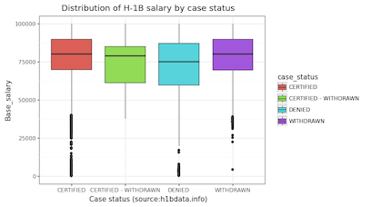

Methods Used & Result(7)
========================================================
**Question 2(Continued)**
- Wrangled the original data set to create a table with count, percentage by each category
- *Plotnine*

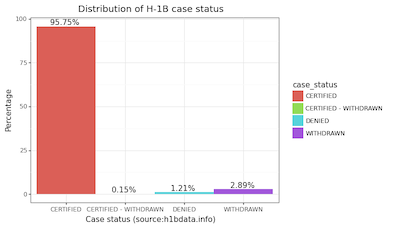

Methods Used & Result(8)
========================================================
**Question 3: Distribution of length of preparation period (submit – start)**
- Convert to datetime, create new column
- *Plotnine*

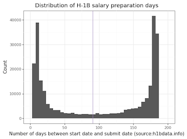

Methods Used & Result(9)
========================================================
**Question 4: What positions have the highest median salaries among certified LCAs**
- Filter "certified" and method chain
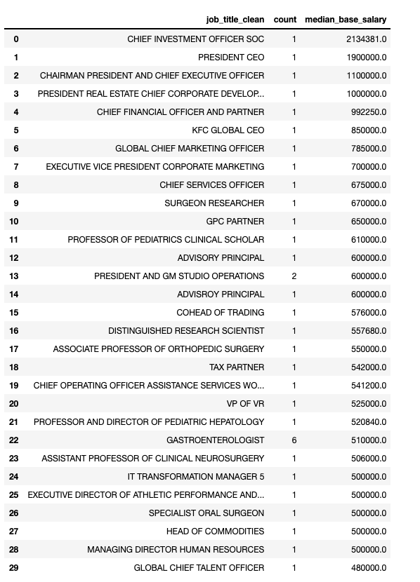

Methods Used & Result(10)
========================================================
**Question 4(Continued)**
- Specify greater than 10 applicants?
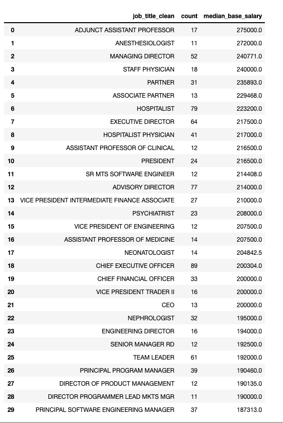

Methods Used & Result(11)
========================================================
**Question 5: Examine the factors that are predictive of an applicant obtaining LCA certification?*
- top companies?
- base_salary?
- job_titles?
- preparation time?
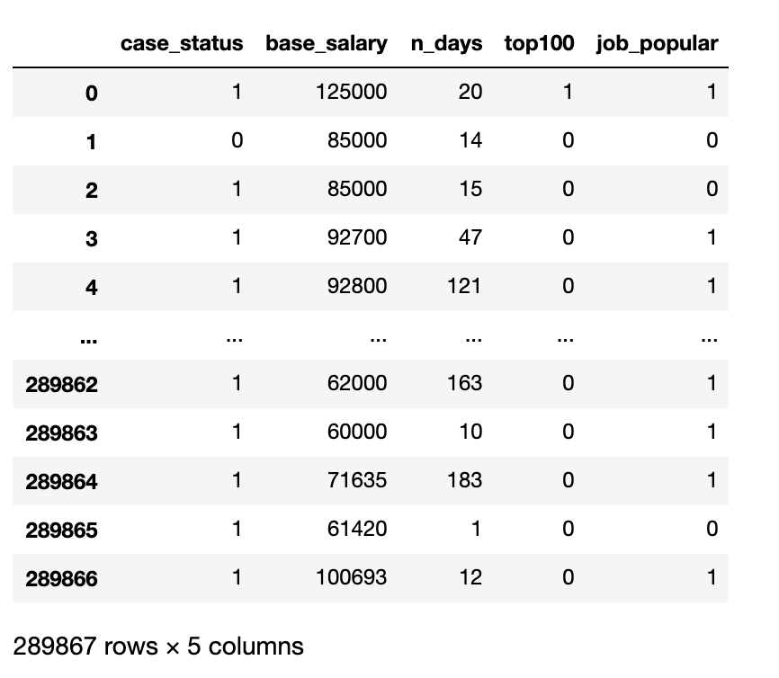

Methods Used & Result(12)
========================================================
**Question 5(continued)**
- *sklearn & gridsearch*

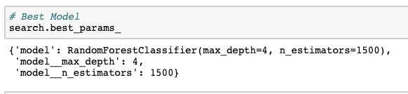
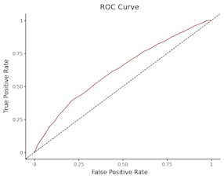

Methods Used & Result(13)
========================================================
**Question 5(continued)**
- *sklearn & permutation*

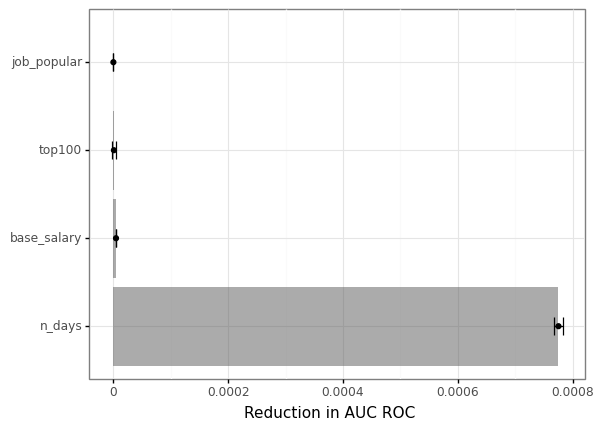

Further thoughts
========================================================
- Unit of analysis
  - Individual
  - Company
  - State
